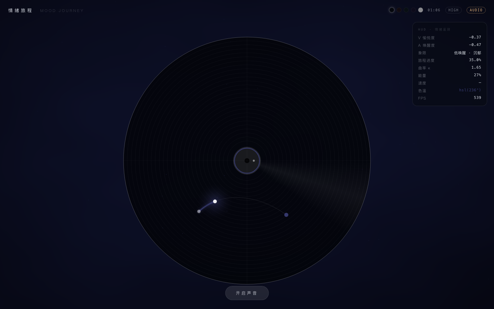
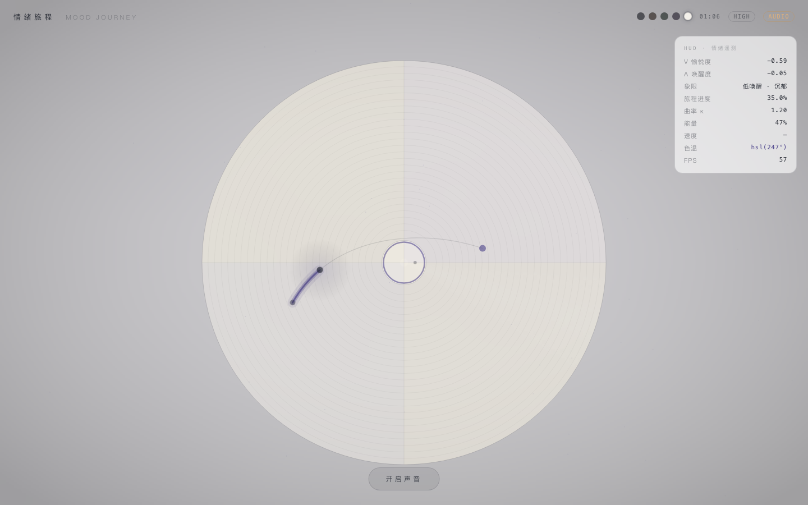

# 情绪旅程 MOOD JOURNEY

> **先接住你此刻的情绪，再用音乐把你带去更好的地方。**
> 无 DJ、无旁白、零表达压力——音乐本身就是引导。

一个用音乐编排情绪旅程的沉浸式电台。说一句话，它在 Russell 情绪平面上找到你的坐标，然后沿一条精心计算的弧线，用几首歌的时间，陪你从「此刻」走到「想去的地方」。


---

## 为什么做这个产品

市面上的音乐产品集中在两个极端，中间留着一个明确的空位：

| 产品类型 | 它们的逻辑 | 缺了什么 |
|---|---|---|
| 传统音乐 App | 静态歌单、偏好匹配，无限制投喂同类情绪 | 只**匹配**，不**引导**——让你在情绪里原地打转 |
| 助眠/冥想类 | 情绪不好就塞给你舒缓纯音乐 | 只**纠正**，不**接纳**——和你真实的听歌审美完全割裂 |
| AI 歌单工具 | 情绪标签 + 关键词检索 | 只**检索**，不**编排**——不懂"先迎合、再过渡"的节奏 |

**「先接纳情绪、再渐进引导，且限定在用户熟悉的曲风内」——这个中间地带，就是情绪旅程站的位置。**

## 核心理念：先接住，再引导

面对负面情绪，我们不说"你要开心起来"。

- 你愤怒，就先给你高唤醒的音乐——**100% 匹配你此刻的能量**，让你感到被同频接住
- 然后在几首歌的时间里，沿一条平滑的路径，一点点把能量降下来
- 全程没有一句语音说教，你甚至不需要说话——**被引导是一场无声的陪伴**

这个逻辑来自音乐治疗的 **ISO 同质原则**（先同频共鸣，再逐步引导改变），我们把它做成了消费级产品里可计算、可复现的机制。

## 它是怎么工作的

```
一句心情                Russell 平面              情绪弧线               音乐旅程
"加班到麻木"  ──→  定位起点坐标 (V, A)  ──→  生成 smoothstep    ──→  沿弧选歌，能量连续渐变
                  LLM 语义推断           缓动路径到终点         每首歌都在弧线上的确定位置
```

- **Russell 情绪平面**：所有情绪被拆解为「效价 V × 唤醒度 A」的二维坐标，情绪引导从主观感受变成可计算的数学对象
- **情绪弧线**：起点到终点的路径用三次贝塞尔 + smoothstep 缓动生成——开头慢（贴近起点迎合）、中段稳推、结尾缓入，严格控制相邻歌曲的情绪跳变步长
- **终点二选一**：仅当候选终点跨象限（真实分歧）时才让你选，其余时候零打扰直接启程
- **数据自校准**：你的每一次终点选择、切歌、共鸣/不对味，都在校准"怎么带你走出情绪"，而不只是"你爱听什么"

## 界面即情绪：黑胶盘面

这个仓库是产品的**视觉表达层**——一块纯前端打造的"情绪装置"：

- **盘面即 Russell 平面**：主视觉是一张黑胶唱片，盘面本身就是情绪平面的投影，情绪弧线画在盘面上像一道发光的音轨
- **呼吸光点**：你此刻的情绪位置，播放时唱片纹路缓缓自转，光点沿弧线移动
- **五套皮肤**：深海 / 暮色 / 苔原 / 雾紫 / 纸白——换的不是配色，是"房间的光"
- **电影级渲染**：逐像素 ACES 色调映射、径向暗角、三层辉光描边，Canvas 2D 手写，零依赖




## 版本更迭

| 版本 | 时间 | 发生了什么 |
|---|---|---|
| v0 · DJ 电台时代 | 2026-08 上旬 | AI 像 DJ 一样选歌、播报、串场。**教训**：人声旁白会把用户从情绪里拽出来 |
| v1 · 无旁白重建 | 08-19 | 砍掉全部 DJ/TTS/RAG 代码，确立「音乐即引导」，核心链路端到端跑通 |
| v2 · 黑胶盘面实验 | 08-21 | 本仓库诞生：纯前端视觉版，提出「盘面即 Russell 平面」的核心视觉隐喻 |
| v2.1 · 盘面合一 | 08-24 | 情绪弧线收进盘面、唱片自转跟随播放状态、背景降噪、正式更名「情绪旅程」 |
| v2.2 · 编辑排版 + 合体 | 08-24/25 | 界面进化为「左文右盘」编辑排版风；接入真实后端：LLM 情绪推断、真实歌曲流、2.5s 交叉淡化切歌、用户行为数据闭环 |

## 本地运行

零构建工具、零外部依赖，任意静态服务器即可：

```bash
python3 -m http.server 8080
# 打开 http://localhost:8080
```

> 注意：ES Modules 要求 http(s) 协议，双击 file:// 无法运行。

## 技术栈

原生 HTML/CSS/JS + ES Modules · Canvas 2D 渲染内核（Perlin 噪声场 / ACES / 辉光） · Web Audio 程序化音乐引擎 · localStorage 持久化

```
index.html      # DOM 骨架
css/main.css    # 全部样式 + 5 套皮肤变量
js/
├── renderer.js # Canvas 2D 内核：流体场/盘面/辉光/后期
├── emotion.js  # Russell 平面：象限/色阶/语义
├── arc.js      # 三次贝塞尔弧线 + smoothstep 缓动
├── audio.js    # Web Audio 程序化音乐引擎
├── skins.js    # 皮肤系统
└── main.js     # 主控：状态机/快捷键/持久化
```

## 相关项目

- **完整线上产品**（后端 + LLM 选歌 + 真实歌曲流）：私有开发中
- [ai-mood-radio](https://github.com/shineyyxd/ai-mood-radio)：v0 DJ 时代版本，存档留念

---

*每一种心情，都是情绪平面上的一个坐标。说一句话，我们为你定位起点——再让音乐沿一条弧线，把你慢慢带去想去的地方。*
