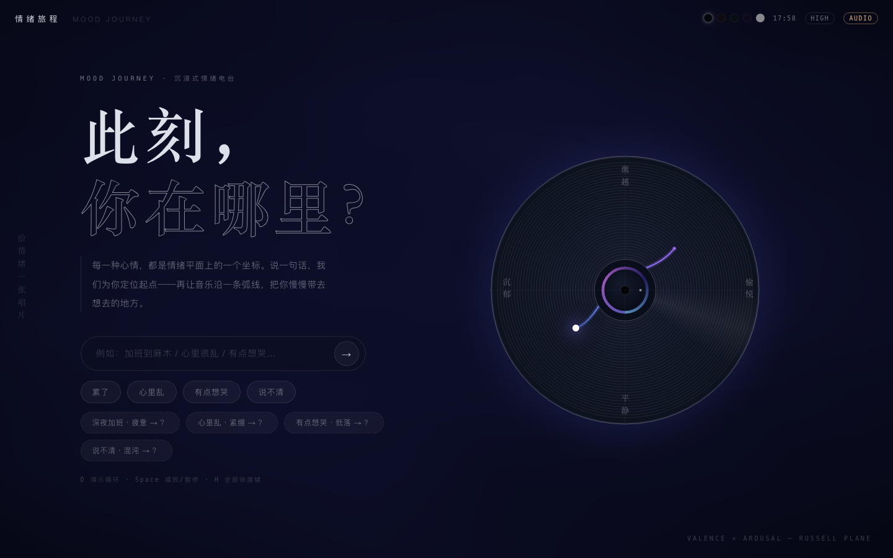

# 情绪旅程 MOOD JOURNEY

> **先接住你此刻的情绪，再用音乐把你带去更好的地方。**

一个我独立做完并上线的 AI 情绪电台。说一句话，它在情绪平面上找到你的坐标，然后用几首歌的时间，把你从「此刻」慢慢带去「更好的地方」。全程没有 DJ、没有旁白、没有人催你开心——音乐自己就是引导。

**在线体验**：https://moodjourney.site



---

## 一、为什么做

有时候压力大，深夜打开音乐 App，算法很贴心地给我推了一堆"丧系歌单"——它精准地匹配了我的情绪，然后把我留在原地。

后来我发现这不是我一个人的问题。调研了一圈（小红书、朋友圈、问卷），18-35 岁的人有个共同的处境：**有情绪，但走不出来**。市面上的产品集中在两个极端——

- 音乐 App 只**匹配**：你喜欢丧就一直给你丧（它的 KPI 是播放时长，引导你走出来会增加切歌率，违背它的利益）
- 冥想/助眠类只**纠正**：情绪不好就塞给你白噪音和钢琴曲（可我平时听 hiphop 和 R&B，难过的时候也不想忽然变成另一个人）

中间那块空地——**先接住你，再慢慢带你走**——没有人做。音乐治疗里有个成熟的 ISO 同质原则（先同频共鸣，再逐步引导），临床上验证了几十年，但没有一个消费级产品把它做轻。我觉得这事值得做。

## 二、我是怎么把它做成的

先说清楚：这不是一版做成的。第一版我做错了。

一开始我其实没有思路。刷抖音的时候发现一个博主也在做情绪电台——不过是带 DJ 播报的那种——他还贴出了项目的骨架图。我照着那张图把项目搭了一遍，自己用了用，觉得没什么问题。直到拿给朋友看，他们说不对劲。

**v0 是个 DJ 电台**：AI 像真人 DJ 一样选歌、播报、串场。朋友的反馈一针见血——人声旁白会把你从情绪里拽出来，"被陪伴"变成了"被说教"。于是整版推翻，删掉全部 DJ/TTS/RAG 代码，确立了这个产品的第一原则：**无旁白，音乐即引导**。

之后的架构都是围绕这条原则做减法：

- **每段旅程只有 2 次 LLM 调用**（一次推断情绪坐标，一次沿弧线选歌），弧线生成、数据、播放全是确定性代码。没有多 Agent，没有向量检索——不是不会，是这个问题的编排是确定性的，重框架只会带来成本、延迟和不确定性
- **情绪被翻译成数学**：所有心情映射到 Russell 平面的 (效价, 唤醒度) 坐标，旅程就是平面上一条 smoothstep 缓动弧线——开头慢（贴近你）、中段稳推、结尾缓入，相邻歌曲的情绪跳变被严格约束
- **LLM 输出被我上了三层保险**：JSON 模式强约束 + prompt 硬约定 + 解析失败原地重试。选歌失败率从最早的约 1/3 压到趋近于零
- **前端零依赖**：唱片盘面是手写 Canvas 2D 渲染的（盘面本身就是 Russell 平面的投影，弧线是音轨，光点是你），一个静态文件服务器就能跑

部署也是自己搞的：腾讯云香港（免备案+国内线路）、Docker 单容器双进程、Caddy 自动 HTTPS、崩溃自愈。服务器一个月 ¥55。

## 三、我没做什么

这节很少有 README 写，但我觉得它比"做了什么"更能说明问题：

- **不做语音旁白**。v0 的教训：语言会出戏。情绪场景里，沉默比安慰高级
- **不做对话式陪伴**。产品的边界是"零表达压力"——你跟它说一句话就够了，它绝不追问
- **不做多 Agent / RAG**。v1 转型时把向量检索整个删了。歌单靠"LLM 常识 + 搜索过滤"就够，RAG 在这里是杀鸡用牛刀
- **不做原生 App**。PWA 都没上，先把假设验证完再说
- **不做账号体系**。匿名 session 就够采数据了，注册门槛会杀死情绪场景的冲动

每一条"不做"背后都有一个"因为"。克制加轻量化，就是这个产品最重要的功能。

## 四、我真实踩过的新技术

这部分给关心"这人是不是真用过"的朋友：

- **推理模型 vs 快模型实测**：Kimi k2.6（推理模型）接入后一切报错——它只接受 `temperature=1`；修好后单次推断要"长考" 30-90 秒，旅程两分钟。换 DeepSeek v4-flash 后 4 秒。两次切换的全部事故记录都在 [USER_FEEDBACK.md](USER_FEEDBACK.md) 里
- **iOS 音频的深水区**：内测用户报"切歌死"，排查发现四层根因连环——代理不支持 Range 分段（iOS 的 `<audio>` 靠 206 续传活）、服务端 15 秒硬超时、iOS 锁屏停 RAF 卡死淡化循环、play() 挂起无超时。修完后我对移动端音频的敬意上升了一个量级
- **多 Agent 协作开发**：这个产品的大量代码是我指挥多个 AI coding agent 并行完成的——实现、调试、部署、考古（甚至考古出一个历史 commit 里从未生效的分享功能 bug）。我的人类角色是：定方向、做取舍、验收
- **试过并放弃**：Stitch（AI 生成 UI 稿）——评估后发现它产出的通用组件没法翻译进我的 Canvas 渲染体系，放弃，手写

## 五、数字

内测期，零投放，真实自然访问：

| 指标 | 数值 | 口径 |
|---|---|---|
| 打开 / 创建旅程 / 完整听完 | 112 / 58 / 7 | 后台打点（匿名 session） |
| LLM 情绪推断认可率 | **84%** | 终点推翻率 16%（44 次分歧中 7 次用户改选） |
| LLM 响应耗时 | 2 分钟 → **4 秒** | 推理模型 → v4-flash 的供应链切换 |
| 选歌失败率 | ~1/3 → **≈0** | 三层输出约束上线前后 |
| 版本迭代 | 9 个版本 / 3 批反馈 | 全部有 commit 和截图存档 |

所有数字都能验证：后台在跑，档案在 [docs/](docs/) 里。

## 六、档案库（这个项目的完整证据链）

| 文档 | 内容 |
|---|---|
| [docs/ARCHITECTURE.md](docs/ARCHITECTURE.md) | 系统骨架图 + 版本演化史 + 架构决策 |
| [docs/INTERACTION_CHANGELOG.md](docs/INTERACTION_CHANGELOG.md) | 交互迭代史（每版操作逻辑变化+对用户的意义） |
| [USER_FEEDBACK.md](USER_FEEDBACK.md) | 用户反馈归档（原文→根因→处理状态） |
| [docs/history/](docs/history/) | 视觉编年史（每个大版本的界面截图） |
| [docs/design/](docs/design/) | 方案 A/B/C 设计稿（C 为定稿） |

## 本地运行

视觉版零依赖，任意静态服务器即可：

```bash
python3 -m http.server 8080   # 打开 http://localhost:8080
```

完整产品（含后端/LLM/真歌）在私有仓库，架构见 [docs/ARCHITECTURE.md](docs/ARCHITECTURE.md)。

---

*每一种心情都有坐标。说一句，让音乐把你带去更好的地方。*
