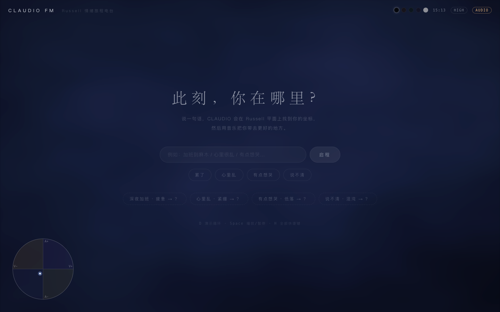
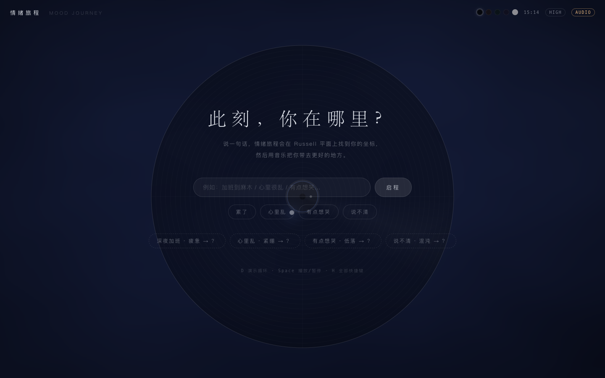
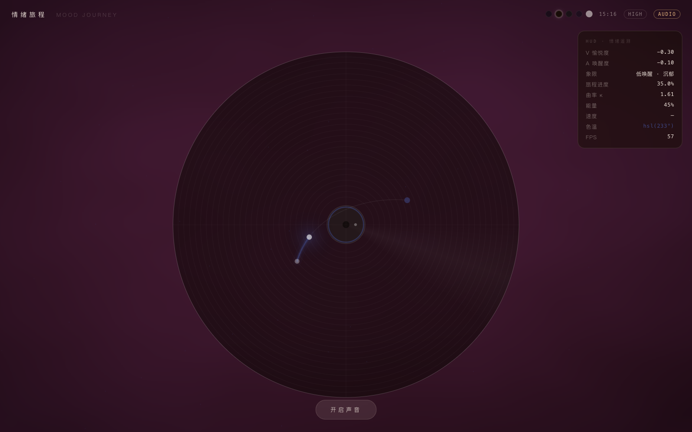
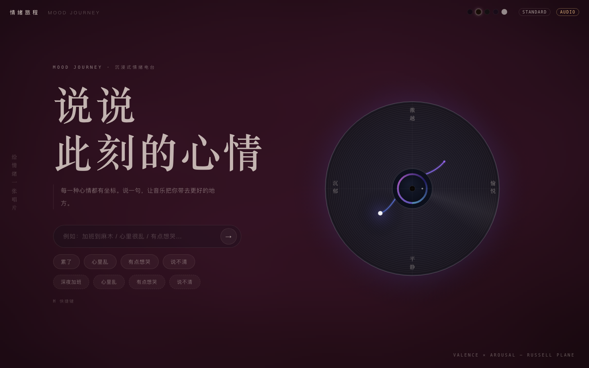
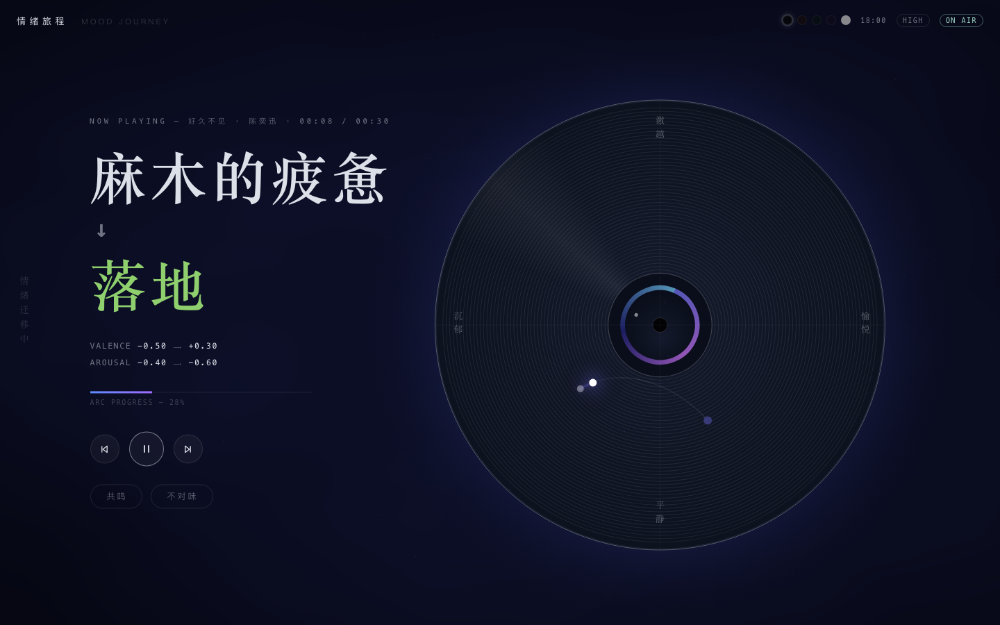
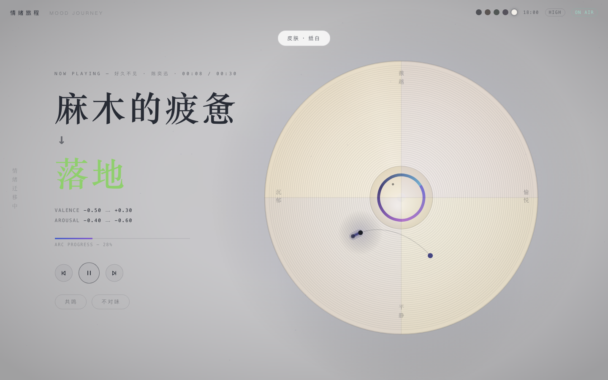

# 交互迭代史 · 情绪旅程

> 这份文档记录的不是 commit 流水账，而是**用户和产品之间的关系**怎么一步步变化：
> 每个版本只回答两个问题——用户是怎么操作的（前后对比），以及这对用户意味着什么。
> 视觉编年史（历史版本截图）见 [history/](history/)；反馈原文归档见 [USER_FEEDBACK.md](../USER_FEEDBACK.md)。

## v0 · DJ 电台时代（2026-08 上旬，ai-mood-radio）

**操作逻辑变化**
用户输入心情 → AI 像电台 DJ 一样语音播报、串场、选歌。交互的主角是"声音"：用户说一句话，然后坐下来听一个人工DJ对自己说话。

**对用户的意义**
人声旁白会把用户从情绪里拽出来——本想被音乐陪伴，结果变成了被说教。"被陪伴"和"被指导"只差一把声音，而这一版站错了边。

## v1 · 无旁白转型（2026-08-19）

**操作逻辑变化**
砍掉 DJ / TTS / RAG 全部语音交互。操作收敛为一条直线：输入心情 → 自动播放，全程没有任何语音。音乐第一次成为唯一的引导者。

**对用户的意义**
确立「音乐即引导」——不说话，也是一种陪伴；而且往往是更好的那种。

## v2.0 · 黑胶视觉实验（2026-08-21，当时叫 CLAUDIO FM）

**操作逻辑变化**
新增 Russell 圆盘可视化：左下角一个小圆盘，可以直接拖拽情绪点；配全套快捷键（Space / Q / T / P / M 等），键盘是主要输入设备。这一版是纯前端视觉实验，还没有真实后端。

**对用户的意义**
第一次把"情绪是平面上的坐标"做成了看得见、摸得着的东西；但交互工程味重——像一台需要说明书的仪器，键盘中心的设计在移动端直接失灵。

## v2.1 · 盘面合一（2026-08-24，更名「情绪旅程」）

**操作逻辑变化**
情绪弧线收进中央大唱片，左下角的小圆盘删除，拖拽迁移到主盘面；唱片自转跟随播放/暂停。用户不再面对"一个主界面 + 一个调试圆盘"的两套心智，而是只面对一张唱片。

**对用户的意义**
视觉隐喻统一了：盘面 = 情绪平面，光点 = 你。操作从"调试一台仪器"变成"摸一张唱片"。

## v2.2 · 方案C 编辑排版 + 前后端合体（2026-08-24/25）

**操作逻辑变化**
界面改为「左文右盘」：左边是大号情绪词和输入框，右边是唱片。接入真实后端：输入 → LLM 推断 → 双终点分歧屏 → 旅程。此前各版的"输入心情"只是前端演示，这一版起用户第一次走真实产品流。

**对用户的意义**
操作逻辑第一次成为真实产品：说一句话 → 选一个想去的地方 → 听歌。产品从"装置"变成了"服务"。

## v2.3 · 首批真实用户反馈修复（2026-08-27/28）

**操作逻辑变化**
操作路径本身没变，变化都在"用户感知不到的地方"：iOS 手势内预解锁音频（用户无感）、VIP 歌曲 30 秒试听截断在选歌端过滤（用户无感，但根治了"放着放着没声"）、标题空心改实心、文字整体提亮、默认皮肤从黑紫改为暮色、移动端画质降载。

**对用户的意义**
这一版的原则是"无感修复"——用户不知道发生了什么，但体验对了。好的修复不是多一个提示，而是少一次困惑。

## v2.4 · 第二批反馈修复（2026-08-28，当前版）

**操作逻辑变化**
六处变化，全部来自真实用户原话：

1. 标题「此刻，你在哪里？」→「说说此刻的心情」——用户说想要更温柔的开场；
2. "永远加载" → 45 秒超时后明示「路上有点堵——再走一次」+ 一键重试——从沉默到温柔明示；
3. 进度条从"看着能拖其实不能" → 真 scrubber，可拖拽定位；
4. V/A 坐标、象限术语从界面撤下——去工程语言，HUD 里仍可查；
5. 预设 chips 走预计算缓存，秒回，不等 LLM；
6. 入口文案砍掉三分之一。

**对用户的意义**
界面开始说人话：不再展示内部机制（坐标、象限、术语），只保留用户决策需要的信息。产品从"把机制给人看"转向"把结果给人用"。

## 方向讨论中（第三批 PM 反馈，2026-08-28，未实施）

> 来自产品经理评审，四条反馈与对应方向，尚未动手。原始记录见 [USER_FEEDBACK.md](../USER_FEEDBACK.md) 第三批。

1. **决策点摩擦高**：现在"输入心情 + 选终点"是两个连续决策点。
   方向：合并为「一次决策 + 一次确认」——自动推荐终点，可切换但不必选。
2. **无法预期输出**：用户在确认前不知道会得到什么。
   方向：在确认瞬间前置展示推断文案（起点词、终点词、旅程描述），让"点下去会发生什么"可预期。
3. **分析完输入就不重要**：输入框完成使命后仍占据视觉中心。
   方向：入口降级为小出口，盘面拖拽收进 HUD——旅程态让唱片和情绪词成为主角。
4. **文案还是多**。
   方向：预设 chips 删除、副文案再砍，入口继续向"一句话 + 一个按钮"收敛。

---

*v2.2 / v2.3 与 v2.4 视觉差异小（同为左文右盘编辑排版），未单独回溯截图；差异以文字记录为准。*
